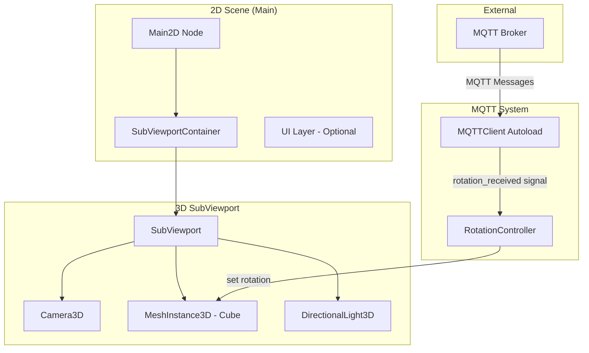
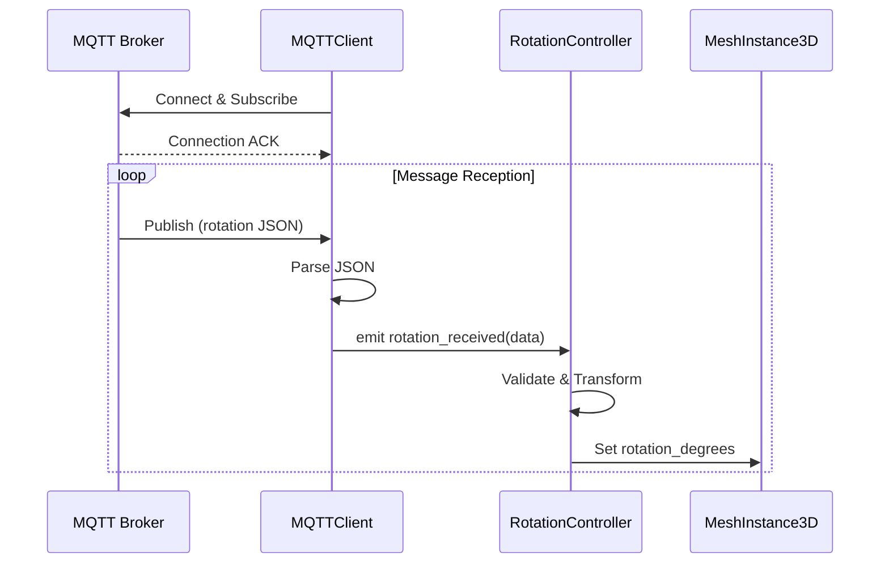

# Design Document: 3D Cube in 2D Scene with MQTT-Controlled Rotation

## Overview

This design describes a Godot 4.6 implementation for displaying a 3D cube within a 2D scene that responds to MQTT messages for rotation control. The architecture uses Godot's SubViewport system to embed 3D rendering within a 2D context, combined with a GDScript-based MQTT client for receiving rotation commands.

The system follows a modular design with clear separation between rendering, networking, and control logic, enabling easy testing and future extensibility.

## Architecture



### Data Flow



## Components and Interfaces

### 1. Main2D Scene (main.tscn)

The root 2D scene that hosts all components.

**Scene Tree Structure:**
```
Main2D (Node2D)
├── SubViewportContainer (SubViewportContainer)
│   └── SubViewport (SubViewport)
│       ├── Camera3D
│       ├── DirectionalLight3D
│       └── Cube (MeshInstance3D)
└── RotationController (Node)
```

**SubViewportContainer Configuration:**
- `stretch = true` - Scales viewport content to container size
- `stretch_shrink = 1` - No downscaling

**SubViewport Configuration:**
- `size = Vector2i(512, 512)` - Base render resolution
- `render_target_update_mode = ALWAYS`
- `transparent_bg = false`

### 2. MQTTClient (Autoload Singleton)

A GDScript-based MQTT client using Godot's StreamPeerTCP for network communication.

```gdscript
class_name MQTTClient
extends Node

signal connected
signal disconnected
signal message_received(topic: String, payload: String)
signal rotation_received(rotation_data: Dictionary)

# Configuration
@export var broker_host: String = "localhost"
@export var broker_port: int = 1883
@export var client_id: String = "godot_cube_client"
@export var rotation_topic: String = "cube/rotation"
@export var reconnect_delay: float = 5.0

# Connection state
var _socket: StreamPeerTCP
var _connected: bool = false

func connect_to_broker() -> Error
func disconnect_from_broker() -> void
func subscribe(topic: String) -> Error
func _process_incoming_data() -> void
func _parse_rotation_message(payload: String) -> Dictionary
```

**MQTT Protocol Implementation:**
- Implements MQTT 3.1.1 CONNECT, SUBSCRIBE, PINGREQ packets
- Handles CONNACK, SUBACK, PUBLISH, PINGRESP responses
- Uses fixed header + variable header + payload structure

### 3. RotationController

Manages rotation state and applies transformations to the cube.

```gdscript
class_name RotationController
extends Node

enum RotationMode { ABSOLUTE, RELATIVE }

@export var cube_path: NodePath
@export var rotation_mode: RotationMode = RotationMode.ABSOLUTE
@export var smooth_rotation: bool = true
@export var rotation_speed: float = 5.0

var _cube: MeshInstance3D
var _target_rotation: Vector3 = Vector3.ZERO

func _ready() -> void
func _process(delta: float) -> void
func apply_rotation(rotation_data: Dictionary) -> void
func set_rotation_mode(mode: RotationMode) -> void
func _validate_rotation_value(value: Variant) -> float
func _clamp_rotation(degrees: float) -> float
```

### 4. Cube3D Setup

The 3D cube mesh with material for clear rotation visualization.

```gdscript
# Cube setup in scene or via script
var cube := MeshInstance3D.new()
cube.mesh = BoxMesh.new()
cube.mesh.size = Vector3(2, 2, 2)

var material := StandardMaterial3D.new()
material.albedo_color = Color(0.2, 0.6, 0.9)
material.metallic = 0.3
material.roughness = 0.7
cube.material_override = material
```

**Camera3D Configuration:**
- Position: `Vector3(0, 2, 5)` - Angled view
- Look at: `Vector3(0, 0, 0)` - Center on cube
- FOV: 45 degrees

## Data Models

### Rotation Message Format (JSON)

```json
{
  "x": 45.0,
  "y": 90.0,
  "z": 0.0,
  "mode": "absolute"
}
```

**Fields:**
| Field | Type | Required | Description |
|-------|------|----------|-------------|
| x | float | No | Pitch rotation in degrees (default: 0) |
| y | float | No | Yaw rotation in degrees (default: 0) |
| z | float | No | Roll rotation in degrees (default: 0) |
| mode | string | No | "absolute" or "relative" (default: uses controller setting) |

### RotationData Dictionary (Internal)

```gdscript
var rotation_data: Dictionary = {
    "x": 0.0,        # Pitch in degrees
    "y": 0.0,        # Yaw in degrees  
    "z": 0.0,        # Roll in degrees
    "mode": "absolute",  # Rotation mode
    "valid": true    # Parsing success flag
}
```

### Configuration Resource

```gdscript
class_name MQTTConfig
extends Resource

@export var broker_host: String = "localhost"
@export var broker_port: int = 1883
@export var client_id: String = "godot_cube_client"
@export var rotation_topic: String = "cube/rotation"
@export var reconnect_delay: float = 5.0
@export var default_rotation_mode: String = "absolute"
```


## Correctness Properties

*A property is a characteristic or behavior that should hold true across all valid executions of a system—essentially, a formal statement about what the system should do. Properties serve as the bridge between human-readable specifications and machine-verifiable correctness guarantees.*

### Property 1: JSON Rotation Parsing Round-Trip

*For any* valid rotation dictionary with x, y, z numeric values, serializing it to JSON and parsing it back through `_parse_rotation_message` SHALL produce an equivalent dictionary with the same rotation values.

**Validates: Requirements 3.1, 3.2**

### Property 2: Missing Fields Default to Zero

*For any* valid JSON object missing one or more of the x, y, z fields, parsing SHALL produce a rotation dictionary where missing fields have value 0.0.

**Validates: Requirements 3.4**

### Property 3: Invalid JSON Graceful Handling

*For any* string that is not valid JSON, `_parse_rotation_message` SHALL return a dictionary with `valid = false` and SHALL NOT throw an exception.

**Validates: Requirements 3.3**

### Property 4: Non-Numeric Value Rejection

*For any* JSON object where x, y, or z contains a non-numeric value (string, null, array, object), `_validate_rotation_value` SHALL return 0.0 for that field.

**Validates: Requirements 3.5**

### Property 5: Absolute Rotation Application

*For any* valid rotation data with mode "absolute" and any initial cube rotation state, applying the rotation SHALL set the cube's `rotation_degrees` to exactly the values specified in the rotation data.

**Validates: Requirements 4.1, 4.2**

### Property 6: Relative Rotation Application

*For any* valid rotation data with mode "relative" and any initial cube rotation state, applying the rotation SHALL add the rotation values to the cube's current `rotation_degrees`.

**Validates: Requirements 4.2**

### Property 7: Rotation Value Clamping

*For any* rotation value outside the range [-360, 360], `_clamp_rotation` SHALL return a value normalized within [-360, 360] using modulo arithmetic.

**Validates: Requirements 4.4**

### Property 8: State Persistence Without Input

*For any* cube rotation state, if no rotation messages are received during a frame update, the cube's `rotation_degrees` SHALL remain unchanged.

**Validates: Requirements 4.5**

### Property 9: Configuration Values Applied

*For any* valid MQTTConfig resource with broker_host, broker_port, and rotation_topic values, the MQTTClient SHALL use those exact values when connecting.

**Validates: Requirements 2.5**

### Property 10: Runtime Mode Switching

*For any* sequence of rotation mode changes (ABSOLUTE to RELATIVE or vice versa), subsequent rotation applications SHALL use the most recently set mode.

**Validates: Requirements 5.2**

### Property 11: Invalid Configuration Defaults

*For any* configuration value that is invalid (empty string for host, negative port, etc.), the system SHALL use the default value instead.

**Validates: Requirements 5.4**

## Error Handling

### Network Errors

| Error Condition | Handling Strategy |
|-----------------|-------------------|
| Broker unreachable | Log error, emit `disconnected` signal, schedule reconnect after `reconnect_delay` |
| Connection timeout | Treat as unreachable, trigger reconnect |
| Connection dropped | Detect via failed PINGRESP, trigger reconnect |
| Socket error | Close socket, log error, trigger reconnect |

### Message Parsing Errors

| Error Condition | Handling Strategy |
|-----------------|-------------------|
| Invalid JSON | Log warning with payload snippet, return `{valid: false}` |
| Missing rotation fields | Use 0.0 for missing fields, continue processing |
| Non-numeric values | Log warning, use 0.0 for invalid field |
| Unexpected message format | Log warning, ignore message |

### Configuration Errors

| Error Condition | Handling Strategy |
|-----------------|-------------------|
| Empty broker host | Use "localhost" default |
| Invalid port (<=0 or >65535) | Use 1883 default |
| Empty topic | Use "cube/rotation" default |
| Missing config resource | Use all defaults, log info |

### Error Logging

```gdscript
# Error severity levels
func _log_error(message: String) -> void:
    push_error("[MQTTClient] " + message)

func _log_warning(message: String) -> void:
    push_warning("[MQTTClient] " + message)

func _log_info(message: String) -> void:
    print("[MQTTClient] " + message)
```

## Testing Strategy

### Unit Tests

Unit tests focus on specific examples, edge cases, and component isolation.

**RotationController Tests:**
- Test `_validate_rotation_value` with valid floats, integers, strings, null
- Test `_clamp_rotation` with boundary values (0, 360, -360, 720, -720)
- Test `apply_rotation` with complete and partial rotation data
- Test mode switching between ABSOLUTE and RELATIVE

**MQTTClient Tests:**
- Test `_parse_rotation_message` with valid JSON examples
- Test `_parse_rotation_message` with malformed JSON
- Test configuration loading from resource
- Test default value fallbacks

**Integration Tests:**
- Test signal flow from MQTTClient to RotationController
- Test cube rotation updates in response to mock messages

### Property-Based Tests

Property-based tests use the GUT (Godot Unit Test) framework with custom generators for comprehensive input coverage.

**Test Configuration:**
- Minimum 100 iterations per property test
- Use GUT's `gut.p()` for parameterized testing
- Custom generators for rotation data dictionaries

**Property Test Implementation Pattern:**

```gdscript
# Example property test structure
func test_property_1_json_round_trip():
    # Feature: 3d-cube-mqtt-rotation, Property 1: JSON Rotation Parsing Round-Trip
    for i in range(100):
        var original = _generate_random_rotation_dict()
        var json_str = JSON.stringify(original)
        var parsed = mqtt_client._parse_rotation_message(json_str)
        
        assert_eq(parsed.x, original.x, "X should match")
        assert_eq(parsed.y, original.y, "Y should match")
        assert_eq(parsed.z, original.z, "Z should match")

func _generate_random_rotation_dict() -> Dictionary:
    return {
        "x": randf_range(-360.0, 360.0),
        "y": randf_range(-360.0, 360.0),
        "z": randf_range(-360.0, 360.0)
    }
```

**Property Tests to Implement:**

| Property | Test Function | Generator |
|----------|---------------|-----------|
| 1 | `test_property_1_json_round_trip` | Random rotation dictionaries |
| 2 | `test_property_2_missing_fields_default` | Partial rotation dictionaries |
| 3 | `test_property_3_invalid_json_handling` | Random invalid strings |
| 4 | `test_property_4_non_numeric_rejection` | Dictionaries with mixed types |
| 5 | `test_property_5_absolute_rotation` | Random rotations + initial states |
| 6 | `test_property_6_relative_rotation` | Random rotations + initial states |
| 7 | `test_property_7_rotation_clamping` | Extreme rotation values |
| 8 | `test_property_8_state_persistence` | Random initial states |
| 10 | `test_property_10_mode_switching` | Random mode sequences |
| 11 | `test_property_11_invalid_config_defaults` | Invalid config values |

### Test File Structure

```
godot/cube-mqtt/
├── test/
│   ├── unit/
│   │   ├── test_rotation_controller.gd
│   │   └── test_mqtt_client.gd
│   ├── property/
│   │   ├── test_rotation_properties.gd
│   │   └── test_parsing_properties.gd
│   └── integration/
│       └── test_mqtt_rotation_flow.gd
```
